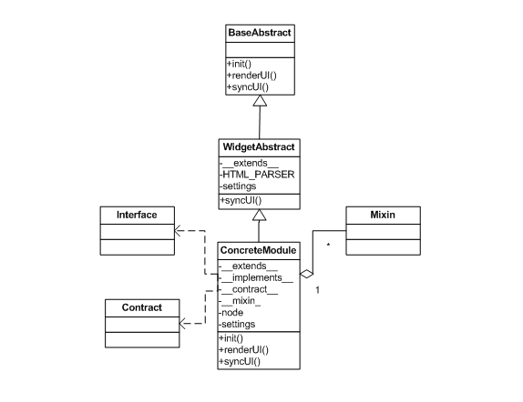

# xObject


[](https://nodei.co/npm/xobject/)

A lightweight hookable factory for JavaScript that turns plain object-literal constructors into a full OOP toolkit: class-based inheritance, mixins, runtime interface validation, and design-by-contract support — all in ES5, zero dependencies.

## Install

```
npm install xobject
```

**Browser** — load the core plus any plugins you need:

```html
<script src="js/source/xObject.core.js"></script>
<script src="js/source/xObject.mixin.js"></script>
<script src="js/source/xObject.interface.js"></script>
<script src="js/source/xObject.dbc.js"></script>
<script src="js/source/xObject.widget.js"></script>
```

Or use the pre-built bundles from `js/build/` (see `npm run build`).

## Quick Start

```javascript
var Animal = function() {
  return {
    speak: function() { return "..."; }
  };
};

var Dog = function() {
  return { __extends__: Animal };
};

var rex = xObject.create(Dog);
rex instanceof Dog;    // true
rex instanceof Animal; // true
rex.speak();           // "..."
```

## Features

| Plugin | File | Pseudo-property | Purpose |
|---|---|---|---|
| Core | `xObject.core.js` | `__extends__` | Single and multi-level prototype inheritance |
| Core | `xObject.core.js` | `__constructor__` | Post-setup initializer called with the original args |
| Mixin | `xObject.mixin.js` | `__mixin__` | Multiple inheritance — copy any number of trait objects |
| Interface | `xObject.interface.js` | `__implements__` | Runtime method signature validation |
| DbC | `xObject.dbc.js` | `__contract__` | Entry/exit type hints and per-argument validators |
| Widget | `xObject.widget.js` | *(via `__extends__`)* | YUI-style lifecycle: `init → renderUi → bindUi → syncUi` |



## API

### xObject.create()

```
xObject.create( constructor )
xObject.create( constructor, argsArray )
xObject.create( constructor, propsObject )
xObject.create( constructor, argsArray, propsObject )
xObject.create( protoObject )
xObject.create( protoObject, propsObject )
```

- **constructor** — a function that returns a plain object literal. Receives `argsArray` as its arguments.
- **protoObject** — a plain object used directly as the prototype (Object.create style).
- **argsArray** — array of arguments forwarded to the constructor and to `__constructor__`.
- **propsObject** — extra properties mixed into the instance after construction (useful for passing settings like `boundingBox`).

Returns an instance whose prototype chain reflects all `__extends__` declarations, with plugin hooks applied.

## Examples

### Inheritance

```javascript
var AbstractClass = function() {
  return {
    foo: "value"
  };
};

var ConcreteClass = function() {
  var _private = "private member";
  return {
    __extends__: AbstractClass,
    publicMember: "public member",
    privileged: function() { return _private; }
  };
};

var obj = xObject.create(ConcreteClass);
obj instanceof ConcreteClass; // true
obj instanceof AbstractClass; // true
obj.foo;        // "value"   (inherited)
obj.privileged(); // "private member"
```

### Constructor arguments

```javascript
var Point = function(x, y) {
  return {
    getX: function() { return x; },
    getY: function() { return y; }
  };
};

var p = xObject.create(Point, [10, 20]);
p.getX(); // 10
p.getY(); // 20
```

### `__constructor__` pseudo-method

Use when you need `this` to set own properties after the prototype chain is built:

```javascript
var Model = function() {
  return {
    __constructor__: function(data) {
      this.id   = data.id;
      this.name = data.name;
    }
  };
};

var m = xObject.create(Model, [{ id: 1, name: "Alice" }]);
m.id;   // 1
m.name; // "Alice"
```

### Mixing in properties

Pass a plain object as the second argument to merge extra properties (same as `Object.create` style):

```javascript
var obj = xObject.create({ foo: "foo" }, { bar: "bar" });
obj.foo; // "foo"
obj.bar; // "bar"

// equivalent with a constructor:
xObject.create(MyClass, [], { boundingBox: "#app" });
```

### Mixins

```javascript
var Serializable = { serialize: function() { return JSON.stringify(this); } };
var Validatable  = { validate:  function() { return !!this.id; } };

var Model = function() {
  return {
    __mixin__: [Serializable, Validatable],
    id: null
  };
};

var m = xObject.create(Model);
m.serialize(); // "{\"id\":null}"
m.validate();  // false
```

### Interface validation

Declare method signatures as an interface object; xObject wraps each method to enforce types at call time.

```javascript
var ILogger = {
  log: ["string"]
};

var ConsoleLogger = function() {
  return {
    __implements__: ILogger,
    log: function(msg) { console.log(msg); }
  };
};

var logger = xObject.create(ConsoleLogger);
logger.log("hello");  // OK
logger.log(42);       // TypeError
```

**Type hint values:** `"string"`, `"number"`, `"boolean"`, `"function"`, `"array"`, or a constructor function (checked with `instanceof`).

```javascript
var IService = {
  process: ["string", MyDependency]
};
```

### Design by Contract

```javascript
var ITemperatureService = {
  convert: {
    onEntry:    ["number"],
    validators: [function(celsius) { return celsius >= -273.15; }],
    onExit:     "number"
  }
};

var TemperatureService = function() {
  return {
    __contract__: ITemperatureService,
    convert: function(celsius) { return celsius * 9 / 5 + 32; }
  };
};

var svc = xObject.create(TemperatureService);
svc.convert(100);    // 212
svc.convert(-300);   // RangeError  (below absolute zero)
svc.convert("100");  // TypeError   (onEntry mismatch)
```

**Contract shape:**

| Key | Type | Description |
|---|---|---|
| `onEntry` | `Array` | Type hint per argument (same values as interface hints) |
| `validators` | `Array<Function>` | Per-argument predicates; `false` throws `RangeError` |
| `onExit` | `string` | Type hint for the return value |

Shorthand `["number", MyClass]` is equivalent to `{ onEntry: ["number", MyClass] }`.

### Widget lifecycle

```javascript
(function($, xObject) {
  "use strict";

  var Toolbar = function() {
    return {
      __extends__: xObject.WidgetAbstract,
      HTML_PARSER: {
        buttons: "ul.buttons"
      },
      bindUi: function() {
        this.node.buttons.find("li").on("click", $.proxy(this.onSelect, this));
      },
      onSelect: function(e) {
        this.node.boundingBox.attr("data-selected", $(e.target).data("id"));
      }
    };
  };

  $(document).on("ready.app", function() {
    xObject.create(Toolbar, { boundingBox: "#toolbar" });
  });

}(jQuery, xObject));
```

When `xObject.create` instantiates a `WidgetAbstract` subclass it:

1. Requires `boundingBox` in the props (throws `TypeError` if missing).
2. Resolves each `HTML_PARSER` selector against `boundingBox` and stores the result in `this.node`.
3. Calls `init`, `renderUi`, `bindUi`, `syncUi` in order (skips any that are not defined).

By default `xObject.querySelectorFn` falls back to `document.querySelector`, or jQuery if present globally. Override it for any other selector engine:

```javascript
xObject.querySelectorFn = function(selector, context) {
  return (context || document).querySelector(selector);
};
```

## Development

```
npm test        # Jest test suite (24 tests)
npm run build   # minified bundles → js/build/
```

## License

MIT
