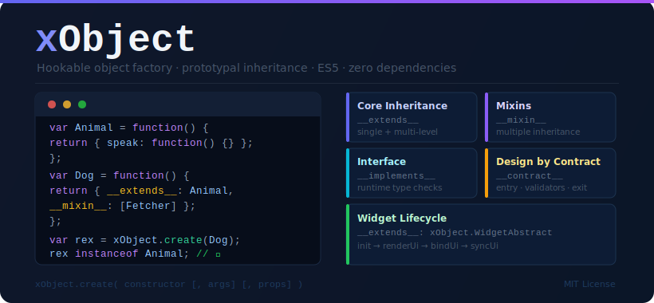

# xObject



[](https://nodei.co/npm/xobject/)

> A lightweight hookable factory providing control over object instantiation.

xObject lets you use the "constructor that returns an object literal" pattern while still getting proper class-based inheritance, mixins, interface validation, and design-by-contract support.

## Install

```
npm install xobject
```

## Features

- **Core** — single-level and multi-level prototype inheritance
- **Mixin** — multiple inheritance via `__mixin__`
- **Interface** — runtime method signature validation via `__implements__`
- **DbC** — design by contract (entry/exit type hints + validators) via `__contract__`
- **Widget** — YUI-style lifecycle (`init → renderUi → bindUi → syncUi`) via `__extends__: xObject.WidgetAbstract`


## Scripts

```
npm test        # run Jest test suite
npm run build   # produce minified bundles in js/build/
```

## Examples

### Class-based descending inheritance

```javascript
var AbstractClass = function() {
      return {
        foo: "value"
      };
    },
    ConcreteClass = function() {
      var _privateMember = "private member";
      return {
        __extends__: AbstractClass,
        publicMember: "public member",
        privilegedMethod: function() {
          return _privateMember;
        }
      };
    };

var obj = xObject.create(ConcreteClass);
obj instanceof ConcreteClass; // true
obj instanceof AbstractClass; // true
```

### Passing arguments to the constructor

```javascript
var ConcreteClass = function(arg1, arg2) {
  var _arg1 = arg1,
      _arg2 = arg2;
  return {
    getArg1: function() { return _arg1; },
    getArg2: function() { return _arg2; }
  };
};

var obj = xObject.create(ConcreteClass, [1, 2]);
obj.getArg1(); // 1
obj.getArg2(); // 2
```

### Using __constructor__ pseudo-method

```javascript
var ConcreteClass = function() {
  return {
    __constructor__: function(arg1, arg2) {
      this.arg1 = arg1;
      this.arg2 = arg2;
    }
  };
};

var obj = xObject.create(ConcreteClass, [1, 2]);
obj.arg1; // 1
obj.arg2; // 2
```

### Mixing in properties (Object.create style)

```javascript
var obj = xObject.create({ foo: "foo" }, { bar: "bar" });
// or: xObject.create(MyClass, [], { foo: "foo" })
obj.foo; // "foo"
obj.bar; // "bar"
```

### Using __mixin__ (multiple inheritance)

```javascript
var MixinA = { propertyA: "propertyA" },
    MixinB = { propertyB: "propertyB" },
    Silo = function() {
      return {
        __mixin__: [MixinA, MixinB],
        ownProperty: "Own property"
      };
    };

var obj = xObject.create(Silo);
obj.ownProperty; // "Own property"
obj.propertyA;   // "propertyA"
obj.propertyB;   // "propertyB"
```

### Using __implements__ (interface validation)

```javascript
var InjectedDependency = function() { return {}; },

    ConcreteInterface = {
      requiredMethod: ["string", InjectedDependency]
    },

    StrictModule = function() {
      return {
        __implements__: ConcreteInterface,
        requiredMethod: function() {}
      };
    };

var dependency = xObject.create(InjectedDependency),
    module     = xObject.create(StrictModule);

module.requiredMethod("a string", dependency); // OK
module.requiredMethod(555, dependency);        // TypeError
module.requiredMethod("a string", {});         // TypeError
```

Allowed type hint strings: `"string"`, `"number"`, `"boolean"`, `"function"`, `"array"`. You can also pass a constructor function to require an `instanceof` match.

### Design by Contract

```javascript
var ConcreteContract = {
      aMethod: {
        onEntry:    ["number"],
        validators: [function(arg) { return arg > 10; }],
        onExit:     "string"
      }
    },
    EmployedModule = function() {
      return {
        __contract__: ConcreteContract,
        aMethod: function() { return "a string"; }
      };
    };

var module = xObject.create(EmployedModule);
module.aMethod(50); // OK
module.aMethod(1);  // RangeError (validator fails)
module.aMethod("x"); // TypeError (onEntry type mismatch)
```

Contract properties:

| Key | Type | Description |
|---|---|---|
| `onEntry` | `Array` | Type hints for each argument |
| `validators` | `Array<Function>` | Per-argument predicate functions; throw `RangeError` on failure |
| `onExit` | `string` | Type hint for the return value |

Shorthand form `["string", MyClass]` is equivalent to `{ onEntry: ["string", MyClass] }`.

### Extending WidgetAbstract

Derived from YUI's widget pattern. When `xObject.create` instantiates a `WidgetAbstract` subclass it:

1. Resolves `HTML_PARSER` selectors against `boundingBox` and stores them in `this.node`
2. Calls `init → renderUi → bindUi → syncUi` in order (only methods that exist)

```javascript
(function($, xObject) {
  "use strict";

  var Intro = function() {
    return {
      __extends__: xObject.WidgetAbstract,
      HTML_PARSER: {
        toolbar: "div.toolbar"
      },
      bindUi: function() {
        this.node.toolbar.find("li").on("click.intro", $.proxy(this.onClickHandler, this));
      },
      onClickHandler: function(e) {
        this.node.boundingBox.attr("data-pattern", $(e.target).data("id"));
      }
    };
  };

  $(document).on("ready.app", function() {
    xObject.create(Intro, { boundingBox: "#intro" });
  });

}(jQuery, xObject));
```

By default `xObject.querySelectorFn` uses `document.querySelector`, or jQuery if it is available in the global scope. Override it to use any other selector engine:

```javascript
xObject.querySelectorFn = function(selector, context) {
  return (context || document).querySelector(selector);
};
```

## License

MIT
